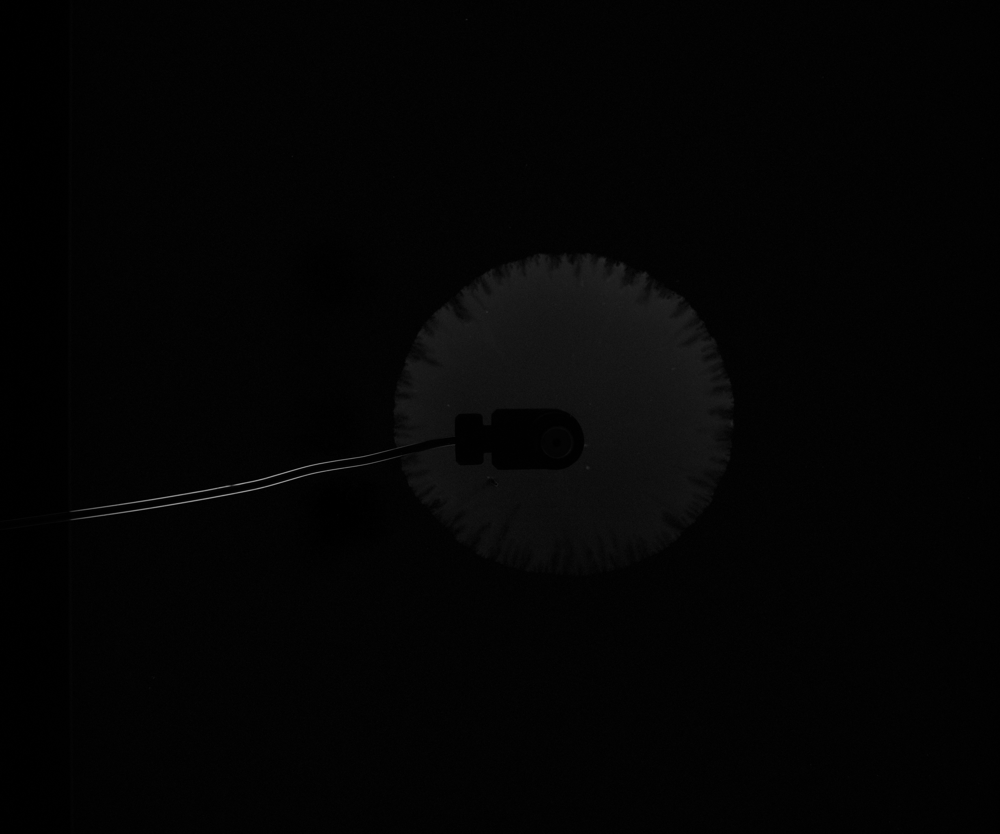
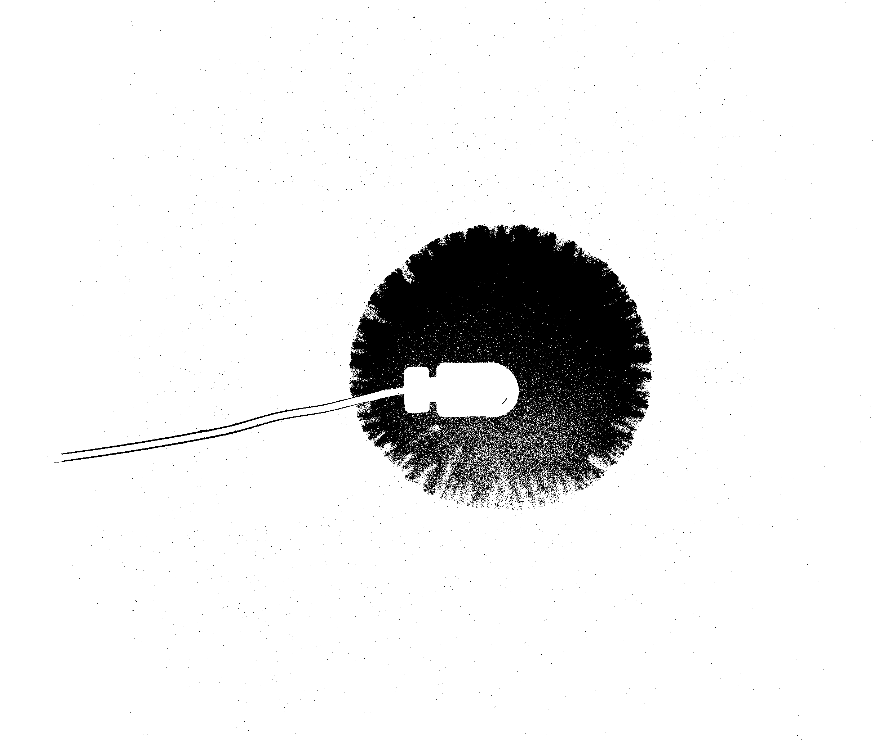

# Description
This repo contains the processing code to process images with instabilities. An instability can look similar to this:


After the background (1 image) has beed substracted


After binarization


Two things are calculted by the porcessing tool:
1. An Area ratio r 
2. Outer shape over time

## Usage

Install all packages by running `pip install -r ./requirements.txt`

The procedure implemented to get the ratio can be seen here:


A configuration might lool like this:
```json
{
    "data_path" : [
        "\\\\gssnas",
        "bigdata",
        "FWDT",
        "DFischer",
        "image_proc"
    ],
    "cases" : [
        "0.1mmspacer_0.015ml_2"
    ]
}
```

SimpleITK

ConnectedThresholdImageFilter

BinaryDilateImageFilter

BinaryErodeImageFilter