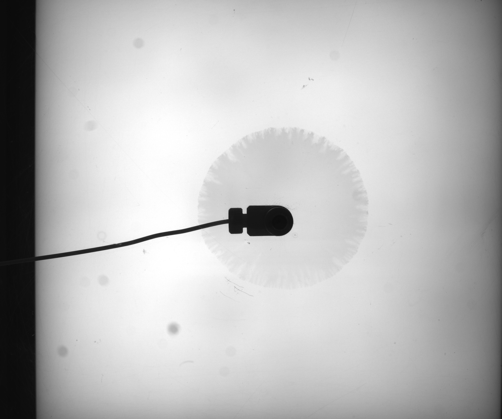

# Description

Within this repository the source code for processing instability data can be found. Instability images look similar to this:



Two main methods are implemented to gain further knowledge on these instabilities.

 - Region growing approach (found in methods.py)
 - Intensity window approach (found in fingers.py)


## Region growing approach

The region growing approach uses a method popular in medicine image analysis the trys to find a connected region the meets a intensity window citeria. For this method the following general steps need to be done:

1. Set seeds to start region growing from. These are the pixel coordinate within the image the region contains.

2. Set upper and lower intensity value. These value have an influence on how large the region gets and what is detected.

3. Start segmentation

Within the developed method here different segmentations are combined to get the result. The steps taken here are:

1. Segment camera from raw image
    - find darcest pixel in the broad image region the camera is in. Search near the middle of the image
    - set the upper threshold recursivly until the segemented region is larger than 4e5 px (the rough dimension of the camera)

2. Use the camera segmentation to set the seeds for the instability. Also find the main axes for the camera. Will be used later to close the camera region.

3. Substract camera from raw image and segment instability from the resulting image
    - Set the lower threshold to the average of the seed's pixel values
    - Set the upper threshold recursivly by detecting a large growth in the segmented region. Then go back a few steps for final segmentation

4. Get rid of artifacts by doing a series of Dilation and Erosion steps

5. Try to close the instability by using the main axes found in camera segmentation
    - If closing is not successfull fill up the camera segemention area and add it to the segmented instability

For additional information the presentation [Instability processing.pptx](doc\presentations\Instability_processing.pptx) might be usefull.

## Intensity window approach

For the intensity window approach fewer steps are done

1. Substract background (first image of a series) from the current image

2. Apply intensity window (thresholds prior set by hand)

3. Apply Dilation and Ersion to get rid of some artifacts. Take this results is finger_image

4. Apply a larger Dilation step to close the fingers. Use this as closed total_area image

5. Calculate ration  $ r = \dfrac{A_{finger}}{A_{total}} $


# Setup

These steps need to be done to use this repo

1. Install python (3.10.4 used for development) and jupyter notebook on your machine

2. Install needed packages by `python -m pip install -r ./requirements.txt`


# Usage

In most cases the things that are done are configured by changing the `config.json` file

|Variable| Description | Default value|
|---|---|---|
|hpc| If code is executed on hpc system | always false |
|hpc_job_dir| Directory to store hpc jobs | |
|data_path| Directory to store intermediate results| |
|raw_data_path| Directory to store raw cases data| |
|results_path| Directory to store results| |
|save_intermediate| if intermediate results should be saved |nearly always true|
|new_files| if existing files/results should be ignored | for development always true |
|debug| if images should be plotted |for development only |
|hpc_job_conf| configuration for cluster jobs||
|images| which images for a case should be processed| leave empty to process all|
|cases| which cases should be processed ||
|limits| limits for intensity threshold approach||
|all_cases| list of all cases in raw_data dir||

## Processing one image

To process one image and for development use the `methods_analysis.ipynb` and `finger_analysis.ipynb` files. Make shure that the following settings are set in `config.json` file:

    - debug: true
    - save_intermediate: true
    - new_files: true
    - images: [<img_number>]
    - cases: [<case_name>]

## Processing all images for a case

To process all images for a case the follwing settings can be used:

    - debug: false
    - save_intermediate: true
    - new_files: false
    - images: [ ]
    - cases: [<case_name>]

## Processing all cases (run on hpc cluster)

To run more than one case on the cluster make shure that within the source code file (`fingers.py` or `methods.py`) the correct method is chosen within the following section:

```python
# fingers.py
...

if __name__ == "__main__":
    # choose things that are done here. Mainly proc_cases() will be of interest
    
    # reset_cases()
    proc_cases()
    # combine_results()
```

```python
# methods.py
...

if __name__ == "__main__":
    # choose things that are done here. Mainly calc_case_ratio() will be of interest
    
    # config = get_config()
    calc_case_ratio()
    # config = get_config()
    # get_all_cases(config)
    # rename_cases(config)
    # multi_contour_plot()
```

Then make shure that the `job_template.sh` file does execute the correct script file

```bash
...
# choose the correct command here

# calculating region growing method
python ./methods.py calc_case_ratio >> $LOG_FILE 2>&1

# calculating using intensity window
# python ./fingers.py proc_cases >> $LOG_FILE 2>&1

Log INFO "JOB FINISH"
```

Then run the `build_jobs.py` file to build the jobs for the specified cases

For the jobs to be executed correctly u need to login into the HPC Cluster and do the following things

1. Create a symbolic link from your home directory to the place the jobs are stored on bigdata: e.g. `ln -s /bigdata/FWDT/DFischer/image_proc/hpc_jobs insta_hpc`

2. Make the script files executable by running 
- change dir to hpc_job dir `cd ~/insta_hpc`
- run command `chmod +x *.sh && dos2unix *.sh`

3. With the `stat.sh` script you can check the queue usage and your running + queued jobs

4. You create and submit the jobs by running `./run_methods.sh`. Choose the option `-a` to run all cases that are not in queue and have not been run yet.  

# Further Development/Improvment

Further improvments can be found within the presentation